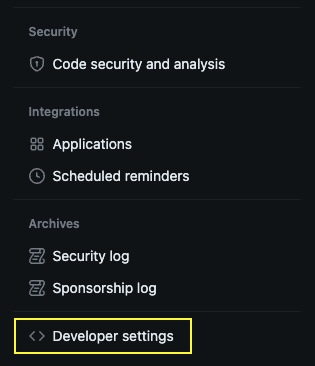
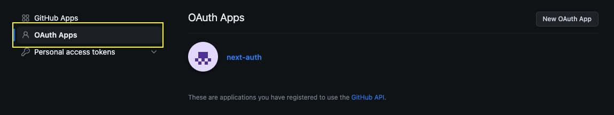
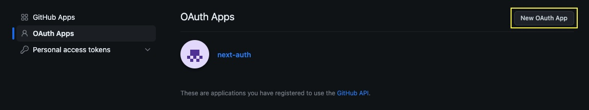

# Authentication with [NextAuth](https://next-auth.js.org/) and GitHub

## Learning Objectives

-   What is authentication?
-   Difference between authentication and authorization
-   How to set GitHub OAuth app
-   How to set up NextAuth

## Authentication

Authentication is the process of verifying the identity of a user, device, or system to ensure that they are who they claim to be. In the context of web development and computer security, authentication is a fundamental concept that plays a crucial role in safeguarding data and resources from unauthorized access. It is typically a part of a broader security system that includes authorization and often encryption.

Here are the key components and concepts related to authentication:

1. **User Identity**: Authentication typically involves confirming the identity of a user. Users can prove their identity through something they know (e.g., a password), something they have (e.g., a smart card or security token), something they are (e.g., biometric data like fingerprints or retina scans), or a combination of these factors (two-factor or multi-factor authentication).

2. **Credentials**: Credentials are pieces of information that a user provides to prove their identity. Common examples include usernames and passwords. In two-factor authentication, one of the factors might be a one-time code generated by a mobile app or hardware token.

3. **Authentication Methods**:

    - **Password-based Authentication**: Users enter a username and password.
    - **Biometric Authentication**: Uses physical characteristics such as fingerprints, facial recognition, or retina scans.
    - **Token-based Authentication**: Users are provided with a time-sensitive code via SMS, email, or a physical token.
    - **OAuth/OpenID Connect**: Allows users to authenticate using an external service like Google or Facebook.
    - **Certificates**: Digital certificates are used for strong authentication, often with public key infrastructure (PKI).

4. **Session Management**: After a user successfully authenticates, a session is established to track their interactions with a web application. This session allows the user to access protected resources without repeatedly re-authenticating.

5. **Authorization**: Authentication is distinct from authorization. While authentication verifies identity, authorization determines what actions or resources a user is allowed to access after they have been authenticated.

6. **Security Tokens**: Secure tokens like JSON Web Tokens (JWT) are commonly used in web applications to manage user sessions and ensure that authenticated users can access authorized resources.

7. **Captive Portals**: In public Wi-Fi networks, users may be redirected to a login page (captive portal) where they must authenticate before accessing the internet.

Authentication is a critical aspect of web security and data protection. Failing to implement proper authentication can lead to unauthorized access, data breaches, and other security vulnerabilities. Web developers need to choose appropriate authentication methods, handle user credentials securely, and implement strong password policies to ensure the security of web applications.

## Authentication vs Authorization

Authentication and authorization are two distinct but closely related concepts in the field of security, often used in conjunction to control access to resources. Here's the key difference between the two:

1. **Authentication**:

    - **Definition**: Authentication is the process of verifying the identity of a user, system, or device to ensure they are who they claim to be.
    - **Purpose**: The primary goal of authentication is to establish the identity of the entity requesting access.
    - **Methods**: Authentication is typically achieved through the presentation of credentials, such as a username and password, biometric data (e.g., fingerprints), security tokens, or other factors that confirm identity.
    - **Outcome**: Successful authentication results in the entity being identified and granted access to the system.
    - **Example**: When you log into a website using your username and password, the system authenticates you by verifying that the credentials match those associated with your account.

2. **Authorization**:

    - **Definition**: Authorization is the process of determining what actions, resources, or data an authenticated user or entity is allowed to access.
    - **Purpose**: The primary goal of authorization is to control and restrict access based on the user's privileges and permissions.
    - **Methods**: Authorization involves defining and managing access control rules, permissions, and policies. It specifies what actions or resources a user can access, modify, or interact with.
    - **Outcome**: Authorization defines what an authenticated entity can do within the system, and it enforces these rules.
    - **Example**: After you log into a system (authentication), the system determines what parts of the application you can access, what actions you can perform, and what data you can view or modify (authorization).

In summary, authentication focuses on confirming the identity of a user or entity, while authorization deals with controlling and specifying the actions and resources that an authenticated entity can access. Both processes are crucial for security, with authentication being the first step in establishing a user's identity and authorization dictating what that authenticated user can do within a system or application. It's common to implement both authentication and authorization mechanisms to ensure proper access control and protect sensitive information.

## Setting up GitHub OAuth app

1. Go to GitHub Developer Settings.

 

2. Click on OAuth Apps.

 

3. Click on New OAuth App.

 

4. Fill in the form:

    - Application name: `name-of-your-app`
    - Homepage URL: `http://localhost:3000`
    - Authorization callback URL: `http://localhost:3000/`

5. Click on Register application.

6. Copy the Client ID and Client Secret.

7. Create a `.env.local` file in the root of your project.

8. Add the following to the `.env.local` file:

```bash
GITHUB_ID=your-client-id
GITHUB_SECRET=your-client-secret
```

## Setting up NextAuth

1. Follow the [NextAuth Getting Started](https://next-auth.js.org/getting-started/example) guide.

    Make sure to name files and folders exactly as in the guide.

    After wrapping your app with the `SessionProvider` component, like this:

    ```jsx
    import { SessionProvider } from "next-auth/react";
    export default function App({
        Component,
        pageProps: { session, ...pageProps },
    }) {
        return (
            <SessionProvider session={session}>
                <Component {...pageProps} />
            </SessionProvider>
        );
    }
    ```

    You can access the session object in your pages like this:

    ```jsx
    import { useSession } from "next-auth/react";
    export default function Page() {
        const { data: session, status } = useSession();
        return (
            <div>
                <h1>My page</h1>
                {session && <p>Signed in as {session.user.email}</p>}
                {!session && <p>Not signed in</p>}
            </div>
        );
    }
    ```

## Setup a MongoDB adapter

1. Make sure have a database for on [MongoDB Atlas](https://www.mongodb.com/cloud/atlas). Update your `.env.local` file with the connection string(`MONGODB_URI`).

2. Follow the [NextAuth MongoDB Adapter](https://next-auth.js.org/adapters/mongodb) guide.

    The MongoDB Adapter will save the user's datails, in a `users` collection, in the database, together with 2 other collections: `sessions` and `accounts`.

## Changing the default `session` object

1. In the `pages/auth/[...nextauth].js`file, inside of your `authOptions` object, add the `callback` property, like this:

    ```js
    const authOptions = {
        providers: [
            Providers.GitHub({
                clientId: process.env.GITHUB_ID,
                clientSecret: process.env.GITHUB_SECRET,
            }),
        ],
        adapter: MongoDBAdapter(clientPromise),
        callbacks: {
            async session({ session, user }) {
                // The user object from the database contains the ID of the user in your database

                session.user.userId = user.id;

                // With the code above you can add the user ID to the session object and use it in your pages

                // Make sure you console.log the session and user objects to see what they contain

                return session;
            },
        },
    };
    ```

## How do add properties to the user object in the database

You can add properties to the user object in the database by adding a `profile` function to your provider object, like this:

```js
const authOptions = {
    providers: [
        Providers.GitHub({
            clientId: process.env.GITHUB_ID,
            clientSecret: process.env.GITHUB_SECRET,
            profile(profile) {
                return {
                    id: profile.id,
                    // This ID is required but it will not be saved in your users collection
                    name: profile.name,
                    email: profile.email,
                    image: profile.avatar_url,

                    // You can add any other properties you want to the user object
                    admin: false,
                    preferedColors: ["#dddddd", "#ffffff"],
                };
            },
        }),
    ],
    adapter: MongoDBAdapter(clientPromise),
    callbacks: {
        async session({ session, user }) {
            session.user.userId = user.id;
            session.user.admin = user.admin;

            return session;
        },
    },
};
```

---

Make sure to always refer to the [NextAuth documentation](https://next-auth.js.org/) when trying to implement new features and for the latest usage examples.
